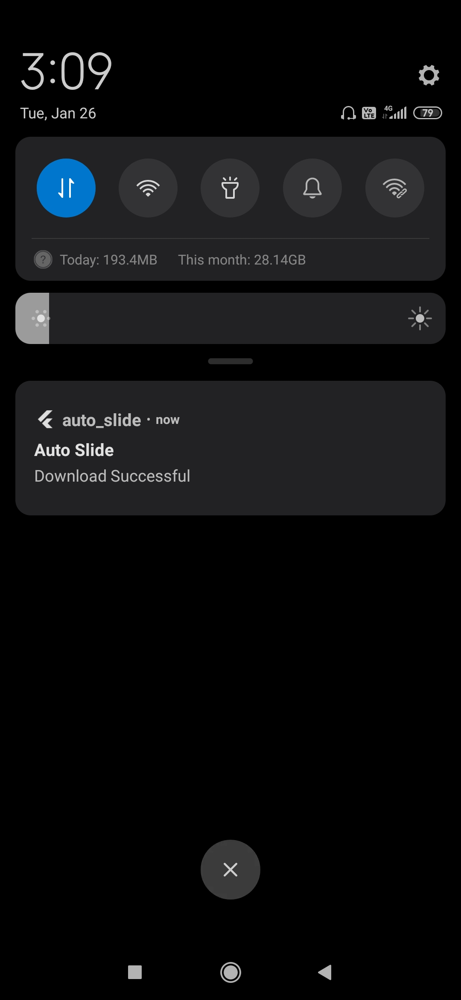

# Auto Slide

A Flutter application that shows sliding images loaded from network, also allows to downlaod those images.

## Images Sliding Demo

## Click on Image to Download

## Download Notification

## Project Structure
**lib**:
       |-- **bloc**      : contains bussiness logic
       |-- **constants** : contains string contants
       |-- **model**     : contains class to represent required data for app
       |-- **network**   : contains network related stuff
       |-- **repository**: contains class that isolates data  source from rest of the app
       |-- **screens**   : contains app screens
       |-- **utils**     : contains helper class

## Data Flow
> *server->repository->bloc->ui*

###### Required json data comes from the server. To get that data packages like [dio](https://pub.dev/packages/dio) and [retrofit](https://pub.dev/packages/retrofit) are used. 
###### Repository isolates that data from rest of the application.
###### Only repository is aware of how and from where data comes in application.  
###### All data comes through repository and goes to bloc.
###### Bloc contains all the business logic like how data will come from repository, how that data will go to ui part, how to handle user action happened on ui, etc.
###### UI part contains app screen that shows data which  comes from bloc. 

## Third Party Packages
#### [carousel_slider](https://pub.dev/packages/carousel_slider)
carousel_slider is used to show sliding images.

#### [dio](https://pub.dev/packages/dio)
dio is used to perform network requests and downloading images.

#### [retrofit](https://pub.dev/packages/retrofit)
retrofit is used to make GET request and get simple response.

#### [retrofit_generator](https://pub.dev/packages/retrofit_generator)
retrofit_generator generates the code for retrofit annotations.

#### [cached_network_image](https://pub.dev/packages/cached_network_image)
cached_network_image is used to show images using image url.

#### [json_annotation](https://pub.dev/packages/json_annotation)
json_annotation defines the annotations used by json_serializable to create code for JSON serialization and deserialization.

#### [json_serializable](https://pub.dev/packages/json_serializable)
json_serializable generates code for json_annotation annotations.

#### [permission_handler](https://pub.dev/packages/permission_handler)
permission_handler is used to get storage permission.

#### [flutter_local_notifications](https://pub.dev/packages/flutter_local_notifications)
flutter_local_notifications is used to show download complete notification.
